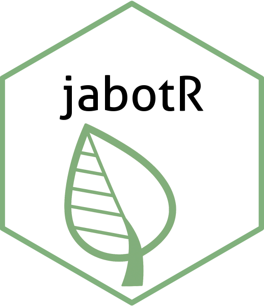

<!-- README.md is generated from README.Rmd. Please edit that file -->

```{r, include = FALSE}
knitr::opts_chunk$set(
  collapse = TRUE,
  comment = "#>",
  fig.path = "figures/",
  out.width = "100%"
)
```

# jabotR 

<!-- badges: start -->
[](https://app.codecov.io/gh/DBOSlab/jabotR)
[](https://github.com/DBOSlab/jabotR/actions/workflows/test-coverage.yaml)
[](https://cran.r-project.org/package=jabotR)
[](https://github.com/DBOSlab/jabotR/actions/workflows/R-CMD-check.yaml)
[](LICENSE)
<!-- badges: end -->


`jabotR` is an R package for accessing and analyzing plant specimen data from the [JABOT online herbarium collections](https://jabot.jbrj.gov.br/v3/consulta.php), hosted by the [Rio de Janeiro Botanical Garden](https://www.gov.br/jbrj/pt-br). It provides tools for downloading, summarizing, and filtering herbarium records in Darwin Core Archive (DwC-A) format via the [JABOT IPT](https://ipt.jbrj.gov.br/jabot).


## Installation

You can install the development version of `jabotR` from [GitHub](https://github.com/DBOSlab/jabotR) with:

``` r
# install.packages("devtools")
devtools::install_github("DBOSlab/jabotR")
```

```r
library(jabotR)
```
\
\

## Usage

A general description of the available main functions (`jabot_download` and `jabot_summary`) that extract original JABOT collections are provided below.\
\

#### _1. `jabot_summary`: Summarizing JABOT collections_

The following code can be used to extract a summary of all JABOT-associated collections, including herbarium acronym, curator's email contact, number of records and a direct link to the original JABOT Integrated Publishing Toolkit ([IPT](https://ipt.jbrj.gov.br/jabot)).\

```r
library(jabotR)

summary_df <- jabot_summary(verbose = TRUE,
                            save = TRUE,
                            dir = "jabot_summary")
```
\
By specifying a vector of herbarium acronyms, the user can extract a summary for just the specific herbarium collection.\

```r
summary_some_df <- jabot_summary(herbarium = c("AFR", "R", "RB"),
                                 verbose = TRUE,
                                 save = TRUE,
                                 dir = "jabot_summary")
```
\
\

#### _2. `jabot_download`: Downloading JABOT specimen records_

The following code can be used to download original specimen records in DwC-A format and associated metada for all JABOT collections.\

```r
library(jabotR)

jabot_download(verbose = TRUE,
               dir = "jabot_download")
```
\
By specifying a vector of herbarium acronyms, the user can download specimens records for just the specific herbarium collection.\

```r
jabot_download(herbarium = c("AFR", "R", "RB"),
               verbose = TRUE,
               dir = "jabot_download")
```
\
\

## Documentation
Full function documentation and articles are available at the `jabotR` [website](https://dboslab.github.io/jabotR-website/).\
\

## Citation
Cardoso, D., Calderón, C. & Silva, L.A.E. 2025. _jabotR_: An R Package for Exploring JABOT Online Plant Specimen Collections. https://github.com/dboslab/jabotR

